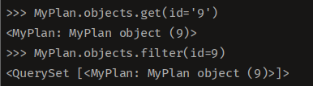

# Django

## templates

- html/css 파일등을 보관하는 곳.
- templates라는 폴더 만들어서 내부에 원하는 파일들을 모아놓자


### HTML

- `<input type="button" value="수정" onclick="location.href='/updateform/{{ dto.id }}'">`

  - location.href: location의 property로 현재 접속정인 페이지 정보를 갖고 있다. 
  - property기 때문에 값을 변경가능. 상단에 있는 코드가 바로 property값을 변경해서 이동을 한 것이다.

  

- DB에 데이터 추가하고 싶을 때는, `<form>` 사용해야한다.

  - action="경로" => 해당 form을 보낼 경로

  - method='post' or 'get' => 전송방식

    - method가 post인 경우, 끝에  추가

    `<form action="/addres/" method="post"> `

  - form 내에 `<input type="submit" value="제출">` 를 작성해서 이 버튼을 누르면 지정된 경로로 (여기서는 addres ) post방식으로 form 내에 input들이 지정된 name으로 구분해서 데이터를 가지고 전송한다
  
  

- DB안에 있는 데이터 수정하고 싶을 때:

  - 마찬가지로 수정한 데이터를 DB에 저장해야하니 `<form>` 사용

    - 꼭 form태그 사용하는 경우에는 input 태그 내에 name 속성을 주어서 가져온 데이터 처리하기 쉽게 하자!

      - `<td><input type="text" name="id" value="{{ dto.id }}" readonly></td>` <= 이런식으로

      

##### Built-in filter

- PIPE(|) 는 variable을 filter하는 data filter와 함께 사용

- django내에 여러 개의 Built-in filter 존재
- 참고: https://docs.djangoproject.com/en/dev/ref/templates/builtins/?from=olddocs#date

- DATE format 변경:
  - date filter 사용!
    - d : day of the month with 2 digits with leading zeros ; 01 to 31
    - D : Day of the week! 3 letters only ex) Fri
    - y : year, 2 digits with leading zeros
    - Y : Year, 4 digits with leading zeros
    - m : month with 2 digits with leading zeros
    - M : Month, 3 letters only ex) Jan
  - `{{ data.mydate | date:"Y-m-d" }}` => data.mydate를 date라는 date filter로 format을 바꿈! 


## views.py


### DB안에 데이터를 불러오기:

```python
from django.shortcuts import render
from .models import MyPlan

def index(request):
    ## order_by는 디폴트 오름차순, - 붙이면 내림차순
    # id기준으로 내림차순해서 MyPlan class에 있는 모든 데이터들(rows) 불러오고 planlist키의 value로 지정해서 index.html로 전달해라.
	return render(request, 'index.html', '{'planlist' : MyPlan.objects.all().order_by('-id')}')})
    
```


### DB에 데이터 추가:

- 이미 insert하는 template가 완성되어있고 submit 버튼을 눌렀을 때 데이터를 전송할 method와 경로인 action 등이 완료되고 나서 진행:

```python
from django.shortcuts import redirect
from django.utils import timezone

# 전송받은 데이터를 내부적으로 처리할 함수 (받은 데이터 DB에 넣는 단계), 당연히 HTML파일 필요x
def addres(request):
    name = request.POST['myname']
    todo = request.POST['mytodo']
    content = request.POST['mycontent']
    date = timezone.now()
	
    ## MyPlan의 인스턴스인 result 생성
    result = MyPlan.objects.create(myname=name, mytodo=todo, mycontent=content, mydate=date)

    if result:
        # 여기서 index와 addform은 앞서 urls.py에 지정한 경로명의 name(별칭)이다.
        return redirect('index')
    else:
        # 참고로 지금은 아무 내용 작성하지 않더라도 date변수가 자동으로 생성되어서 이 부분은 실행되지 않는다
        return redirect('addform')
```

- 현재 이 코드는 POST방식으로 데이터를 전달받았는데, myname, mytodo 등은 앞서 작성한 insert.html의 input태그 내 지정한 이름들이다.
- 가져온 데이터들을 변수에 할당하여 이 변수를 값으로 가진 result라는 인스턴스를 생성한 것이다
  - :heavy_check_mark: 이전까지 생성해왔던 방식은 myplan = Myplan(myname=name, mytodo=todo ... 이런식으로 작성하고 `myplan.save()`를 했었는데, create 방식을 사용하면 자동으로 저장하기 때문에 훨씬 간편하고 간결하다
  - 참고: https://docs.djangoproject.com/en/2.2/ref/models/relations/#related-objects-reference
- redirect는 render와 다르게 어떤 인자를 가지고 해당 경로로 이동이 불가능하다. 


### DB에서 원하는 데이터 찾기

- 현재 urls.py에서 인자를 받아온 상태(urls.py의 Path converter 파트 참고)

- urls.py가 꺽새안에 지정한 이름으로(여기에서는 id) 인자를 받아온다

  - ```python
    def detail(request, id):
        # 여기서 dto는 내가 임의로 지정한 key
    	return render(request, 'detail.html', {'dto' : MyPlan.objects.get(id=id)})
    ```

##### get

- DB에서 하나의 row만을 가져오기 위해서 사용한다. 
- get으로 가져온 data의 type은 내가 생성한 Class의 object이다.
- 그래서 내가 지정한 속성으로 접근이 가능하다

- 하지만 해당 조건의 데이터가 없으면 에러가 뜨는 경우가 많아서 if & else와 함께 쓰는 경우가 많다.

##### filter

- 조건에 맞는 여러 row들을 반환한다. 
- get과 다르게 해당 조건의 데이터가 없을 때 빈 queryset을 반환한다
- queryset object를 반환한다

|                   | GET                                                | FILTER                    |
| ----------------- | -------------------------------------------------- | ------------------------- |
| 데이터가 없을 때: | ERROR                                              | 빈 queryset 반환          |
| return value:     | 하나의 데이터만 반환, Class의 object type으로 반환 | 조건에 맞는 여러 row 반환 |
| 속성접근:         | 내가 만든 속성으로 접근 가능                       | 불가능                    |


### DB내 데이터 수정:

- `id=request.POST['id']` 이런식으로 작성해서 데이터를 전달 받아 저장
- 가져온 id로 filter method를 통해 원하는 row만 추출
- update 메소드 OR 속성지정을 통해 데이터 변경(속성지정 방법은 __filter__ 안되고 __get__방식만 가능) 
- :white_check_mark: filter method는 queryset을 반환하고 get은 해당 class의 object로 반환해서 속성으로 접근 가능해서 가능한 것임!!!!!

```python
def editres(request):
    id = request.POST['id']
    todo = request.POST['mytodo']
    content = request.POST['mycontent']
    date = timezone.now()

    # update.method 사용
    myplan = MyPlan.objects.filter(id=id)
    result_todo = myplan.update(mytodo = todo)
    result_date = myplan.update(mydate = date)
	
    # 직접 속성 지정, save()필수!
    myplan2 = MyPlan.objects.get(id=id)
    myplan2.mycontent = content
    myplan2.save()

    ## update로 전달 받은 변수는 update를 진행한 row의 개수 반환!
    # 그래서 만약 update로 변경한 row의 개수가 2개이상 (즉 같은 아이디가 여러개일 때)이면, redirect를 실행하지 않기 위해 작성
    if result_todo  + result_date == 2:
        return redirect('/detail/' + id)
    else:
        return redirect('/updateform/' + id)
```

 

### DB안의 데이터 삭제:

- 삭제는 버튼만 누르면 작동하니 따로 HTML파일이 필요없다

- 어떤 데이터를 삭제할지 알아야하니 인자를 urls.py로 부터 받아온다! (그러면 delete 버튼이 있는 html에서 id를 전달을 제일 먼저해야하는데, onclick="location.href='/delete/{{ dto.id }}'" 이 부분 때문에 urls.py가 알아서 잘 받아올 것임.

- 삭제방법:

  - filter 함수 사용! 
  - `data_to_delete = MyPlan.objects.filter(id=id).delete()`
  - delete메소드는 set로 두 인자를 전달하는데
    - 첫번째 argument는 삭제 대상인 row의 개수
    - 두번째 argument는 삭제 대상인 데이터들의 개수와 정보를 dict형태로
    - The delete method, conveniently, is named delete(). This method immediately deletes the object and returns the number of objects deleted and a dictionary with the number of deletions per object type.
    - => (2, {'myplan.MyPlan': 2}) (데이터가 두개일 때)

  ```python
  def delete(request,id):
      result_delete = MyPlan.objects.filter(id=id).delete()
      print(result_delete)
      
      # 즉 첫번째 argument가 존재할 때.
      if result_delete[0]: 
          return redirect('/')
      else:
          return redirect('/detail/' + id)
  ```

  

## urls.py

#### Path Converter

- `path('detail/<int:id>', views.detail, name='detail')`
  - HTML에서 `<a href="">` 로 data.id를 detail의 url로 이동하면서 전달한 상태.
  - 전달되는 value를 받아올려면(이 예제에서는 data.id ) `<>`를 사용하면 된다
  -  받아온 value는 사용자가 원하다면 int와 같은 converter와 함께 작성
  -  만약 int를 쓰면 받은 id를 int타입으로 바꾸고 지정한 views.detail(경로)에게 인자로 전달 (순서 중요)
  - __참고로 꺽새안의 id라는 이름은 본인이 마음대로 지정가능하지만, views.py가 이 인자를 전달받을 때는 같은 이름으로 받아야함.__
  - converter미작성시 str이 디폴트이고 '/'를 제외한 모든 문자열을 받아옴
  -  path의 converter에는 str, int, slug, uuid, path 등이 존재


## 기타:

- manager(manage.py) : 데이터베이스 쿼리와 연동되는 인터페이스. 디폴트 모델 매니저의 이름은 objects!

- 경로정리 :

  - POST방식일 때는 끝에 꼭 / 이거 작성 (post방식 사용했으니 추가적인 url이 따라 붙지 않는거 reminded!)

  - 경로 정리

    1. href='/notice'
       경로가 '/'로 시작하면 path를 초기화 시켜 처음부터 시작하겠다는 의미이다.
       따라서 다음과 같이 적는다면 버튼을 눌렀을 때 http://127.0.0.1:8000/로 이동된다.
    2. href='notice'
       이런 형식은 현재 페이지의 URL에 notice를 '추가'해버리는 방법이기 때문에 누를 때마다 계속해서 notice가 URL에 추가되어 버린다.

    

- Settings의 database에서 HOST, USER의 역할!

  - HOST: defines the location of your MySQL sever and database, hostname을 알아야 접근 가능하고, 만약 localhost라면 이 말은 실행중인 DB가 같은 서버에서 진행중이란 뜻임
  - USER: login information을 포함한 MySQL에 있는 USER table의 record이다. 이 user들을 통해서 access를 관리하는 것임, root account는 superuser account이며 wide array of privileges를 가지고 있음.

  

- \_\_str\__ : \_\_str\__없이 사용하면 내가 만든 클래스 객체로 보여주고 안에 내용물을 들여다보지 않는 이상 바로바로 파악이 힘든데,
  __str__메서드 사용하면 내가 지정한 str()내의 내용이 클래스 객체로 대신으로 나옴.

  - 즉 입력한 값을 객체대신 그대로 출력해서 보고 싶을 때 사용

  - ```python
    ##터미널 창:
    
    # shell 열기 (sql)
    python manage.py shell
    
    ## myplan 이라는 앱 내에 models.py 파일내의 MyPlan class import 해줘
    >>> from myplan.models import MyPlan
    
    ## 객체 내용 확인
    >>> MyPlan
    
    ## get 활용 
    >>> MyPlan.objects.get(id=1)
    
    ## filter 활용 
    >>> MyPlan.objects.filter(id=1)
    ```

  - 현재 모습:

    - 코드:

      ```python
      from django.db import models
      
      class MyPlan(models.Model):
          myname = models.CharField(max_length=20)
          mytodo = models.CharField(max_length=500)
          mycontent = models.CharField(max_length=2000)
          mydate = models.DateTimeField()
      
          def __str__(self):
              return str({'myname':self.myname, 'mytodo':self.mytodo, 'mycontent':self.mycontent,'mydate':self.mydate})
      ```

      

    - 

    

  - 결과창 :

    - with `__str__` :
    - 

    - without `__str__` :
    - 


- ORM의 역할 : SQL을 직접 작성하지 않아도 장고 모델을 통해 데이터베이스로 접근가능 (조회/추가/수정/삭제)


- 인자를 받아올 때 
  - post 방식으로 받아온 데이터라면, request.POST['속성이름'] 작성해주고,
  - 그냥 urls.py에서 받아온거라면 id를 매개변수에 써주고 이용하면 된다

