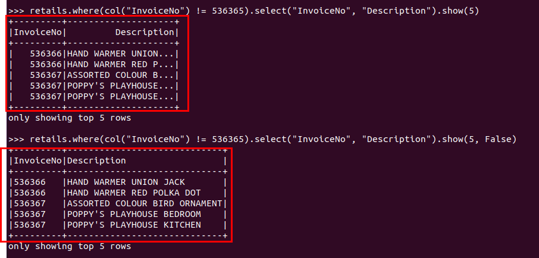

# Spark

- Pyspark 접속 :

  - `start-dfs.sh`
  - `start-yarn.sh`

  - 잘 접속됐는지 확인 :

    - `jps`

    - localhost:9870 접속 

  - `pyspark`


## SparkSQL

- Ansi 표준 query가지고 작업 가능.
- DF을 가지고 1) ANSI 표준 query문  또는 2)sparksql 모듈안의 내장 메소드들 활용해서 원하는 데이터만 추출 가능!
  - sparkSQL모듈 안에 dataframe이 있는 것임 
  - query문으로 원하는 데이터를 가져오기 위해서 이 데이터를 DF형태로 만들어야함

- https://spark.apache.org/docs/latest/ -> API Docs를 Python으로 -> API reference -> Spark SQL 밑에 Dataframe이 있음 클릭!

---

- DF 만들기 :
  - `변수명 = spark.range(n).toDF("컬럼명")` : 해당 컬럼명의 DF 생성
    - `myRange = spark.range(1000).toDF("number")` : 컬럼이름이 number인 DF로 만듬
    - `myRange.head(10)` => [Row(number=0), Row(number=1), Row(number=2), Row(number=3), Row(number=4), Row(number=5), Row(number=6), Row(number=7), Row(number=8), Row(number=9)]
    - `myRange.tail(10)` => [Row(number=990), Row(number=991), Row(number=992), Row(number=993), Row(number=994), Row(number=995), Row(number=996), Row(number=997), Row(number=998), Row(number=999)]


- DF에서 원하는 데이터만 추출 :

  - `변수명=DF명.where("조건문")` : df에서 해당 조건에 맞는 값 가져오기

    - `divisBy2 = myRange.where("number % 2 = 0")` : myRange의 number컬럼에서 나머지가 0인 애를 가져와라

    - `divisBy2.head(5)` => [Row(number=0), Row(number=2), Row(number=4), Row(number=6), Row(number=8)] 

    - `divisBy2.count()` => 500


---

#### 데이터 가져오기

##### .csv

- 어제 다운받은 flights-csv-2010-summary.csv 가져올 것임

1) 컬럼명 지정 없이 가져오기 :

- `flights2010 = spark.read.csv("/home/jisu/data/flights/csv/2010-summary.csv")`

- `flights2010.printSchema()` => 

=> 컬럼 이름 지정안햇더니 알아서 _c0, _c1등으로 지정, 데이터 타입도 알아서 지정

`flights2010.take(5) `=> [Row(_c0='DEST_COUNTRY_NAME', _c1='ORIGIN_COUNTRY_NAME', _c2='count'), Row(_c0='United States', _c1='Romania', _c2='1'), Row(_c0='United States', _c1='Ireland', _c2='264'), Row(_c0='United States', _c1='India', _c2='69'), Row(_c0='Egypt', _c1='United States', _c2='24')] 

=>  우리는 첫번째 row를 컬럼명으로 지정해야겠네?


2. 컬럼명 젤 첫번째 row로 지정하기

- `flights2010 = spark.read.option("header", "true").csv("/home/jisu/data/flights/csv/2010-summary.csv")` : option에 header를 True하면, header를 컬럼명으로 사용하겠다는 뜻

- `flights2010.printSchema()`

- `flights2010.take(5)`


- `.explain()` : 실행계획 확인하기 : 
  - `flights2010.sort("count").explain()` : count라는 column으로 정렬할건데 어떻게 실행될건지 계획좀 보자 :

```
== Physical Plan ==
*(1) Sort [count#53 ASC NULLS FIRST], true, 0
+- Exchange rangepartitioning(count#53 ASC NULLS FIRST, 200), ENSURE_REQUIREMENTS, [id=#130]
   +- FileScan csv [DEST_COUNTRY_NAME#51,ORIGIN_COUNTRY_NAME#52,count#53] Batched: false, DataFilters: [], Format: CSV, Location: InMemoryFileIndex[hdfs://localhost:9000/home/jisu/data/flights/csv/2010-summary.csv], PartitionFilters: [], PushedFilters: [], ReadSchema: struct<DEST_COUNTRY_NAME:string,ORIGIN_COUNTRY_NAME:string,count:string>
```


---

##### .json

- `f2015 = spark.read.format("json").load("/home/jisu/data/flights/json/2015-summary.json")` : 이거는 DF상태임

- `f2015.show()` => 터미널에서 db실행했던 모습과 유사하게 나옴 (defalut는 20)


- `f2015.show(f2015.count())` : 다 출력

- `f2015.show(5)` : 5개만 출력

---


### Practice

- QUERY & 내장 메소드 2가지 방식 번갈아가면서 진행할 예정
  - QUERY는 DF를 테이블로 변경해야함
  - 내장메소드는 pyspark.sql.functions에 있음
- `f2015.createOrReplaceTempView("flights2015")` : flights2015라는 테이블 생성


=> 두 방법다 실행계획도 동일


---

- query : `spark.sql("SELECT MAX(COUNT) FROM flights2015").take(1)` : count이라는 컬럼명 중에서 가장 큰 값

- 메소드 : 

  ```
  from pyspark.sql.functions import max
  f2015.select(max("count")).take(1)
  ```

---

- query : `spark.sql("SELECT DEST_COUNTRY_NAME, ORIGIN_COUNTRY_NAME FROM flights 2015 LIMIT 5").show()`
- 메소드 : `f2015.select("DEST_COUNTRY_NAME", "ORIGIN_COUNTRY_NAME").show(5)`

---

- 번외 : 
  - expr VS col

```python
from pyspark.sql.functions import expr, col

f2015.select(expr("DEST_COUNTRY_NAME"), col("DEST_COUNTRY_NAME")).show(5)
```

=> 결과가 동일

```python
f2015.select(expr("DEST_COUNTRY_NAME as destination")).show(5)

f2015.select(col("DEST_COUNTRY_NAME").alias("destination")).show(5)

# selectExpr() : select() + expr()
f2015.selectExpr("DEST_COUNTRY_NAME as destination").show(5)
```

=> 결과 동일


- `f2015.selectExpr("*", "(DEST_COUNTRY_NAME = ORIGIN_COUNTRY_NAME) as domestic_flight").show()` : 모든 컬럼을 가져오고 + 출발지와 도착지가 같은 국내선은 true, 아닌건 false로 출력하는 domestic_flight라는 컬럼 추가해서 출력

---

- 집계 :

  - query : `spark.sql("SELECT AVG(COUNT), COUNT(DISTINCT(DEST_COUNTRY_NAME)) FROM flights2015").show()` : 중복값은 뺀 dest_country_name을 count함

  - 메소드: `f2015.selectExpr("AVG(COUNT)", "COUNT(DISTINCT(DEST_COUNTRY_NAME)) ").show()` => 즉 spark내장 메소드 일일이 찾을 필요없이 selectExpr활용하면 간단하게 활용 가능!

---

- lit :

  - query : 

  - ```python
    # lit = literal : 값 자체
    # 즉 걍 lit(1)하면 1 값 자체 넣어주는 것임
    
    from pyspark.sql.functions import lit
    f2015.select(expr("*"),lit(1).alias("one")).show()
    ```

  - 메소드 :  `spark.sql("SELECT *, 1 as one FROM flights2015 LIMIT 5").show()`

---

- withColumn("컬럼명", "값") : 컬럼 추가
  - 메소드 : `f2015.withColumn("DOMESTIC_FLIGHT", expr("DEST_COUNTRY_NAME = ORIGIN_COUNTRY_NAME")).show()` : 전체 컬럼에다가 추가로 domestic_flight 보여주는 withColumn

---

- withColumnRenamed() : 컬럼명 바꾸기(실제값은 안바꿈)
  - 메소드 : `f2015.withColumnRenamed("DEST_COUNTRY_NAME", "DESTINATION").show()`

---

- drop("컬럼명") : 해당 컬럼 drop한 상태에서 보여주기(실제값 변경 X)
  - 메소드 : `f2015.drop("count").show()`
  - 메소드2 : `f2015.drop("count").columns` : 현재 내가 볼 수 있는 (count라는 컬럼이 drop된 상태의) 컬럼 보여줌

---

- 데이터 타입 바꾸기:

- 메소드 : cast("데이터타입")

  - `f2015.withColumn("count2", col("count").cast("string")).summary`  : 요약만 보여줌

  - `f2015.withColumn("count2", col("count").cast("string")).show()`

- query : CAST(컬럼명 as 데이터타입)
  - `spark.sql("SELECT *, CAST(count as string) AS count2 FROM flights2015").show()`

---

- 필터링하기/조건걸기

- 메소드 :  filter(조건문), where(조건문)
  - `f2015.filter(col("count") < 2).show(5)`
  -  `f2015.where("count < 2").show(5)`
  -  `f2015.where(col("count") < 2).show(5)`

- query : 
  - `spark.sql("SELECT * FROM flights2015 WHERE count < 2 LIMIT 5").show()`


- 여러 조건걸기
- 메소드 : 
  - `f2015.where(col("count") < 2).where(col("ORIGIN_COUNTRY_NAME") != "Croatia").show(5)`
  -  where조건으로 여러 조건할 때는 where가 동시에 실행됨! (병렬 처리) 그러다보니까 조건1 다음 조건2가 안될 수도 있대

- 쿼리 :
  - `spark.sql("SELECT * FROM flights2015 WHERE count < 2 AND ORIGIN_COUNTRY_NAME <> 'Croatia' LIMIT 5").show()`

---

- 중복제거 
- 메소드 : distinct()
  - `f2015.select("DEST_COUNTRY_NAME").distinct().count()`
- 쿼리 : 
  - `spark.sql("SELECT COUNT(DISTINCT DEST_COUNTRY_NAME) as count FROM flights2015").show()`

---

- 번외 :
  - 메소드로 행 추가하기

```python
from pyspark.sql import Row

new_rows = [
	Row("Korea", "Korea", 5),
	Row("Korea", "Wakanda", 1)
]

# 리스트를 RDD로 변경
rdd_rows = sc.parallelize(new_rows)

# 스키마 저장
schema = f2015.schema

# spark.createDataFrame(행(RDD), 변경하고 싶은 스키마)
# rdd_rows를 해당 schema와 똑같이 하는 df인 'df_rows'를 생성
df_rows = spark.createDataFrame(rdd_rows, schema) 
df_rows.show()

# df1.union(df2) : 같은 스키마를 가지고 있는 df2를 df1밑에 추가
# f2015와 df_rows를 union 하고, count = 1이고 origin이 us가 아닌 데이터 출력 :
f2015.union(df_rows).where("count = 1").where(col("ORIGIN_COUNTRY_NAME") != "United States").show() 
# count가 1이고 origin_country_name이 us가 아닌 row를 df_rows에서 가져오고 그 데이터를 f2015에 합쳐라.

```


---

- 정렬
- 메소드 : sort(), orderBy()

  - `f2015.sort("count").show(f2015.count())` => 오름차순 디폴트

  - `f2015.orderBy(col("count").asc()).show(f2015.count())` : 오름차순

  - `f2015.orderBy(col("count").desc()).show(f2015.count())` : 내림차순
- 쿼리 : 

  - `spark.sql("SELECT * FROM flights2015 ORDER BY COUNT desc").show(f2015.count())`
- 실습 :
  - DEST_COUNTRY_NAME은 내림차순, 그 이후 같은 애들은 COUNT기준으로 오름차 정렬 후 5개 출력하기
  - 쿼리 :
    - `spark.sql("SELECT * FROM flights2015 ORDER BY DEST_COUNTRY_NAME DESC, COUNT ASC LIMIT 5").show()`
  - 메소드 :
    - `f2015.orderBy(desc("DEST_COUNTRY_NAME"), asc("count")).show(5)`
    - `f2015.orderBy(["DEST_COUNTRY_NAME", "count"], ascending=[0, 1]).show(5)`
    - `f2015.orderBy(col("DEST_COUNTRY_NAME").desc(), col("count").asc()).show(5)`

---

---

Retails 파일로 작업 시작!

- `retails = spark.read.format("csv").option("header", "true").option("inferSchema", "true").load("/home/jisu/data/retails/2010-12-01.csv")` : 
  - inferschema : 각 필드의 data type을 자동으로 추측해줌 (샘플 레코드를 읽어서 스키마 추측). 만약 inferschema가 false라면 우리가 직접 schema를 specify해야함. 

- `retails.printSchema()` : schema확인 가능
- `retails.createOrReplaceTempView("retails")`


---


- `retails.where(col("InvoiceNo") != 536365).select("InvoiceNo", "Description").show(5, False)` : show(false)하면 ..으로 생략되던 애들까지 다보여줌



- `retails.where("InvoiceNo <> 536365").show(5, False)` : <>도 가능!


---

- 조건 3개 이상 작성하기 :

  - 메소드 :

  - ```python
    from pyspark.sql.functions import instr
    
    ## 조건을 변수에 담기
    priceFilter = col("UnitPrice") > 600 
    # istr()은 1부터 인덱스 시작
    descripFilter = instr(retails.Description, "POSTAGE") >= 1 # : retails.Description 이렇게 컬럼 가져올 수도 있음
    
    retails.where(retails.StockCode.isin("DOT")).where(priceFilter | descripFilter).show()
    ```

  - 쿼리 :

  - ```python
    # sql
    spark.sql("""
    SELECT * FROM retails
    WHERE StockCode in ('DOT') AND (UnitPrice > 600 OR INSTR(Description, 'POSTAGE') >= 1)
    """).show()
    ```

---

- ***

- 새로운 컬럼 추가하면서 해당 컬럼 기준으로 조건 걸어서 출력하기 :

  - 가격 비싼지/안비싼지 따지는 컬럼 추가하고 비싼 데이터만 출력

```python
## 메소드 :
# 조건 1 : StockCode가 DOT임
dotCodeFilter = col("StockCode") == "DOT" 

# 조건 2 : UnitPrice가 600 초과
priceFilter = col("UnitPrice") > 600

# 조건 3 : 묘사에 Postage가 있음
descriptFilter = instr(col("Description"), "POSTAGE") >= 1

# Boolean값을 가진 isExpensive 컬럼을 만들고, isExpensive가 True인 데이터의 UnitPrice, isExpensive 컬럼을 출력
retails.withColumn("isExpensive", dotCodeFilter & (priceFilter | descriptFilter)).where("isExpensive").select("UnitPrice", "isExpensive").show(5)
```

```python
## 쿼리 :
spark.sql("""
SELECT UnitPrice, (StockCode = 'DOT' AND (UnitPrice > 600 OR INSTR(Description, 'POSTAGE') >= 1)) as isExpensive
FROM retails
WHERE (StockCode = 'DOT' AND (UnitPrice > 600 OR INSTR(Description, 'POSTAGE') >= 1))
""").show()
```

=> query문에서 select절에서 조건을 넣으면 해당 조건에 맞는 데이터만 True값으로 출력


---

- (현재 개수(Quantity) * 가격(UnitPrice))^2 + 5 출력하기 :

```python
## 메소드 :
from pyspark.sql.functions import pow

# pow(값, 지수)
quantity = pow(col("Quantity") * col("UnitPrice"), 2) + 5

retails.select(col("CustomerId"), quantity.alias("myQuantity")).show(5)
```

```python
## 쿼리 :
# POWER(값, 지수)
spark.sql("""
SELECT CustomerId, POWER((Quantity * UnitPrice),2) + 5 as myQuantity
FROM retails
""").show(5)
```


- 내림/ 반올림

```python
## 메소드 :
from pyspark.sql.functions import round, bround

# round() : 반올림, bround() : 내림
retails.select(round(lit("2.3")), bround(lit("2.5")), lit("2.5")).show(5)
```

```python
## 쿼리 :

# ROUND(), BROUND()
spark.sql("SELECT ROUND(2.5), BROUND(2.5) FROM retails").show(5)
```


- 통게 자료 보기:

```python
## 메소드1 : 
# describe() : count, mean, stddev, min, max 출력
retails.describe().show()

## 메소드2 : 
from pyspark.sql.functions import count, mean, stddev_pop, min, max
# 모집단, 표본집단 차이 때문에 stddev_pop하고 stddev_samp
retails.select(count("UnitPrice"), mean("UnitPrice"), stddev_pop("UnitPrice"), min("UnitPrice"), max("UnitPrice")).show()
```


- 증가 숫자 만들기 :

```python
## 메소드
# monotonically_increasing_id() : 0부터 증가하는 숫자를 데이터마다 부여하는 함수
from pyspark.sql.functions import monotonically_increasing_id

retails.select("*", monotonically_increasing_id()).show(5)
```


- 단어의 첫글자만 대문자로 : 

```python
## 메소드
# initcap() : 단어들의 첫글자만 대문자로
from pyspark.sql.functions import initcap

retails.select(initcap(col("Description")), col("Description")).show(5, False)
```


- 모두 대문자 or 소문자로 :

```python
## 메소드
# upper(), lower() 
from pyspark.sql.functions import lower, upper

retails.select(col("Description"), lower(col("Description")), upper(col("Description"))).show()
```


- 공백제거 or 정렬 후 공백 채우기
  - lpad(단어, 길이, 채울모양) : 오른쪽 정렬하고 왼쪽에 글 채우기

```python
## 메소드
# ltrim(), rtrim(), trim()
# lapd(단어, 길이, 채울모양), rpad(단어, 길이, 채울모양) : lpad()는 오른쪽 정렬하고 왼쪽에 원하는 글, rpad()는 반대
from pyspark.sql.functions import ltrim, rtrim, trim, lpad, rpad

retails.select(ltrim(lit("  hello    ")).alias("ltrim"), rtrim(lit("    hello   ")).alias("rtrim"), trim(lit("   hello   ")).alias("trim"), lpad(lit("hello"), 10, "*").alias("lpad"), rpad(lit("hello"), 10, "*")).show(1)

```

```python
## query : 
spark.sql("""
SELECT LTRIM('   hello  ') as ltrim, RTRIM('   hello   ') as rtrim, TRIM('  hello ') as trim, LPAD('hello', 10, '*') as lpad, RPAD('hello', 10, '*')
FROM retails
""").show(1)
```


---

- 정규표현식

```python
## 메소드 :
# regexp_replace(바꿀컬럼, 정규식, 바꿀데이터(_to)) : 정규식 조건에 맞는 데이터는 지정한 바꿀데이터로 바꾼다 
from pyspark.sql.functions import regexp_replace

# | : ~중 하나
regex_str = "BLACK|WHITE|RED|GREEN|BLUE"

# Description 컬럼의 데이터 중 regex_str라면 "COLOR"라는 단어로 바꿔라 
retails.select(regexp_replace(col("Description"), regex_str, "COLOR").alias("color"), col("Description")).show(5, False)
```

```python
## 쿼리 :
# REGEXP_REPLACE(바꿀컬럼, 정규식, 바꿀데이터(_to))
spark.sql("""
SELECT REGEXP_REPLACE(Description, 'BLACK|WHITE|RED|GREEN|BLUE', 'COLOR') as color, Description
from retails
""").show(5, False)
```


- 만약 정규식 사용안하려면 :

```python
## 메소드 :
from pyspark.sql.functions import translate

# translate(컬럼명, "바꿀 문자들", "바꾸고 싶은 문자들") : 값 변경 가능
retails.select(translate(col("Description"), "ABCD", "1234"), col("Description")).show(5, False)
```

---

- 조건에 맞는 단어 뽑아내기 :

```python
## 메소드 :
from pyspark.sql.functions import regexp_extract

# regexp_extract(컬럼명, 정규식, 인덱스) : 해당 컬럼명의 정규식에 맞는 값들 중 인덱스 위치에 해당 되는 값 반환

# Description에 extract_str중 있는 단어들은 다 꺼내서 거기서 1번째 단어 가져오기
extract_str = "(BLACK|WHITE|RED|GREEN|BLUE)"
retails.select(regexp_extract(col("Description"), extract_str, 1).alias("extract"), col("Description")).show(5, False)
```


---

- 글자 포함 유무 표시하는 열 만들기 :

```python
## 메소드 :
# Black 이나 White라는 글자 유무 in description 열 만들기

# 조건 1
containsBlack = instr(col("Description"), "BLACK") >= 1

# 조건 2
containsWhite = instr(col("Description"), "WHITE") >= 1


retails.withColumn("hasBlackWhite", containsBlack | containsWhite).select("Description", "hasBlackWhite").show(5, False)
```

---


##### 날짜

- 현재날짜 뽑아서 관련 테이블 만들기 :

```python
## 메소드 : 
from pyspark.sql.functions import current_date, current_timestamp

# current_date() : 년 월 일
# current_timestamp() : 년 원 일 시 분 초 까지
date_df = spark.range(10).withColumn("today_date", current_date()).withColumn("now_timestamp", current_timestamp())

date_df.show(5, False)

# 테이블 생성 for query :
date_df.createOrReplaceTempView("dateTable")
```


- 날짜 더하기 빼기 

```python
## 메소드 :
from pyspark.sql.functions import date_add, date_sub

# date_add(컬럼, n) : n일만큼 더하기
# date_sub(컬럼, n) : n일만큼 빼기
date_df.select(date_sub(col("today_date"), 5), date_add(col("today_date"), 5)).show(1)
```

```python
### query :

# DATE_ADD(컬럼, N)
# DATE_SUB(컬럼, N)
spark.sql("""
SELECT DATE_SUB(today_date, 5) as sub, DATE_ADD(today_date, 5) as add
FROM dateTable
""").show(1)
```


---

- 날짜 차이 계산

```python
## 메소드 :
from pyspark.sql.functions import datediff, months_between, to_date

# datediff(날짜1, 날짜2) : 날짜1 - 날짜2
# 일주일 전과 지금 날짜의 차이 찾기
date_df.withColumn("week_ago", date_sub(col("today_date"), 7)).select(datediff(col("week_ago"), col("today_date"))).show(1)


# to_date("문자열", {형식}) : 데이터 타입 날짜로 변경
# months_between(날짜1, 날짜2) : 날짜1 - 날짜2
date_df.select(to_date(lit("2022-03-15")).alias("now"), to_date(lit("2022-05-13")).alias("end")).select(months_between(col("now"), col("end"))).show(1)
```

- 번외 : 만약 입력한 리터럴 값이 없는 날짜라면 null값 처리 :

```python
date_df.select(to_date(lit('2022-12-32'))).show(1)
# => 결과가 null로 나옴
```


---


- 문자열의 형식 알려줘서 날짜 데이터 가져오기

- ```python
  ## 메소드
  
  # 문자열의 어느 부분이 년도, 일자, 월인지 알려주고 이거를 date 타입으로 변경
  dateFormat = 'yyyy/dd/MM'
  clean_date = spark.range(1).select(to_date(lit('2022/11/12'), dateFormat).alias('date'))
  clean_date.show()
  ```


---

- 번외 : None값은 table로 바꾸면 Null로 변경되어서 출력

- ```python
  ## query :
  from pyspark.sql import Row
  
  null_df = sc.parallelize(
  [
  		Row(name='Kang', phone='010-0000-0000', address='Seoul'),
  		Row(name='Shin', phone='010-1111-1111', address=None),
  		Row(name='You', phone=None, address=None)
  ]
  ).toDF()
  
  null_df.createOrReplaceTempView("nullTable")
  spark.sql("SELECT * FROM nullTable").show()
  ```

---

##### Null값 관련

- null이 아닌 첫번째 컬럼 가져오기 :

```python
## query
from pyspark.sql.functions import coalesce

# coalesce(컬럼명) : null이 아닌 첫번째 컬럼을 가져옴. 만약 다 null이면 null 가져옴
# address와 phone컬럼중 null아닌 첫번째 값을 가져와라
null_df.select(coalesce(col("address"), col("phone")).alias("coalesce")).show()
```


- 결측값 처리 :

```python
## query :
# ifnull : 첫번째 값이 null이면 두번째 값 리턴
# nullif : 두 값이 같으면 null, 다르면 1번째 인자값 가져옴
# nvl : 첫번째 값이 null이면 두번째 값 리턴
# nvl2 : 첫번째 값이 null이면 세번째 값, 아니면 두번째 값 리턴

spark.sql("""
SELECT IFNULL(NULL, 'VALUE'), NULLIF('SAME', 'SAME') , NULLIF('SAME', 'NOTSAME'), NVL(NULL, 'VALUE'), NVL2(NULL, 'VALUE', 'VALUE2'), NVL2('NOTNULL', 'VALUE', 'VALUE2')
FROM nullTable
""").show(1)
```


- 결측치 제외 세기 :

```python
## 메소드 :

# na.drop({"any"/"all"}) : 해당 조건에 맞게 결측값 제거 
null_df.count() # 데이터 총 개수
null_df.na.drop().count() # : null값 삭제 후 세기
null_df.na.drop("any").count()  # : 컬럼중 하나라도 null값 있으면 drop
null_df.na.drop("all").count() # : 모든 컬럼의 값이 null값이면 drop
```

:white_check_mark: na.drop()은 import할 필요 X


- 특정 컬럼만 결측치 제외 세기 :

```python
## 메소드 : 

# na.drop({"any"/"all"}, subset=[컬럼]) : 해당 조건에 맞게 해당컬럼의 결측값 제거 
null_df.na.drop("all", subset=['phone']).count() #: phone이라는 컬럼에 값이 null이라면 제외하고 count
null_df.na.drop("all", subset=['phone', 'address']).count() #: phone하고 address 둘다 na이면 drop해서 count
```


- 특정 컬럼/ 전체에 결측지 처리 :

```python
## 메소드 :

# na.fill("변경할 값", subset=[]) : 해당 컬럼의 결측치는 변경할 값으로 변경
null_df.na.fill("n/a").show() #: null값은 n/a라는 문자열로 채움
null_df.na.fill("n/a", subset=["name", "address"]).show() #: name컬럼과 address컬럼만 찾아서 null값을 n/a로 바꿈. phone column은 null값이 null로 그대로 나옴


```

```python
## query :

# na.fill({컬럼명 : 대체값, 컬럼명2 : 대체값2 ..}) : 결측값 대체값 지정
fill_cols_val = {"phone" : "070-000-0000", "address" : "street"}
null_df.na.fill(fill_cols_val).show()
```

=> 각 컬럼별로 다르게 결측치 처리 가능!!!!!!!!!!!!!!!!


```python
## 메소드 : 

# na.replace([변경전 값], [변경값], '컬럼명') : 해당컬럼의 변경전 값은 변경값으로 변경
# address컬럼의 Seoul은 서울로 변경
null_df.na.replace(["Seoul"], ["서울"], "address").show() 
null_df.na.replace({"Seoul" : "서울"}).show()
```


- na.fill VS na.replace
  - na.fill : na값만 변경
  - na.replace : 원하는 값을 변경


---


- 구조체 : DF 안에 DF
  - `retails.selectExpr("(Description, InvoiceNo) as complex", "*").show(5, False)`

​			=> Description하고 InvoiceNo가 중괄호로 묶여서 complex라는 **하나의 컬럼**으로 나타나고 있음 : 이걸 구조체 (complextype)이라고함

```python
## 메소드 :
from pyspark.sql.functions import struct

# struct("컬럼1", "컬럼2") : 컬럼1과 컬럼2를 합침 (구조체로 만듬)  
complex_df = retails.select(struct("Description", "InvoiceNo").alias("complex"))

## 쿼리 :
complex_df.createOrReplaceTempView("complexdf")
spark.sql("""
select *
from complexdf
""").show()


```

```python
## 쿼리 :
# complex(column이 여러개)중 원하는 한 column만 가져오기

# 1) complex명.내부컬럼명
complex_df.select("complex.Description").show(5, False)

# 2) complex명.getFeild('내부컬럼명')
complex_df.select(col("complex").getField("InvoiceNo")).show(5, False)
```


- complex에서 모든 컬럼 분리해서 가져오기 :

```python
# 쿼리:

complex_df.select("complex.*").show(5, False)
```


---


##### array

- array를 조작하는건 query문으로는 안됨 !!!!!

- 특정 기준으로 분리하기 :

```python
## 메소드 :
from pyspark.sql.functions import split

# split(컬럼명, "기준") : 해당 기준으로 분리하기
retails.select(split("Description", " ")).show(5, False)

# 리스트로 만든 것중 첫번째 요소만 가져오기 : 
retails.select(split(col("Description"), " ").alias("arrays")).selectExpr("arrays[0]").show(5)
```


- array 길이 출력 :

```python
## 쿼리 :
from pyspark.sql.functions import size

# size(요소로 구성된 컬럼) : 길이 반환
retails.select(size(split(col("Description"), " ")).alias("array_size")).show(5)

```


- array내에 특정 값 가지고 있는지 여부 출력 :

```python
## 쿼리 :
from pyspark.sql.functions import array_contains

# array_contains(array로 구성된 컬럼, "값") : 컬럼에 해당 값을 가지고 있는 데이터는 true, 없는 컬럼은 false로 출력
retails.select(array_contains(split(col("Description"), " "), "WHITE")).show(5)
```

---


- 두 컬럼합치면서 키 -> 값으로 표현하기 

```python
## 쿼리 :
from pyspark.sql.functions import create_map

# create_map(컬럼명1, 컬럼명2) : 두 컬럼을 합치되 , 중괄호안에 화살표로 나타남. 키 -> value 형태로. 
retails.select(create_map(col("StockCode"), col("Description")).alias("complex_map")).show(5, False)
```


```python
## 쿼리 :

# complex_map에 85506B가 포함된 컬럼 가져오기
retails.select(create_map(col("StockCode"), col("Description")).alias("complex_map")).selectExpr("complex_map['84406B']").show()
```


- user-defined-functions(udf) : 사용자 함수 등록하기

```python
## 메소드 :
# 일반함수 정의
def power3(value):
	return value**3

power3(3)

# udf(함수식) : 실제로 내장 메소드 처럼 활용 가능
from pyspark.sql.functions import udf

pow3 = udf(power3)

user_def_df = spark.range(5).toDF("num")
user_def_df.select(pow3(col("num")), col("num")).show()
```


##### 여러 file 합치기 :

- 여러 file합치는건 메모리가 많이 필요하니까 지양..

```python
# retails폴더 내에 있는 모든 csv파일을 합쳐서 하나의 retails_all이라는 변수에 저장
retails_all = spark.read.format("csv").option("header", "true").option("inferSchema", "true").load("/home/jisu/data/retails/*.csv")

# table로도 생성 : 
retails_all.createOrReplaceTempView("retailsAll")
```


- 중복 제거 개수 세기 :

```python
## 메소드 :
from pyspark.sql.functions import countDistinct

# countDistinct() : 중복 제거해서 개수 세기
retails_all.select(countDistinct("*").alias("countDistinct")).show()
```

```python
## query : 

# COUNT(DISTINCT())
spark.sql("SELECT COUNT(DISTINCT(*)) AS COUNTDISTINCT FROM retailsAll")
```


- 첫번째 데이터, 마지막 데이터 출력 :

```python
## 메소드 :
from pyspark.sql.functions import first, last

# first(컬럼명) : 해당 컬럼의 첫번째 값
# last(컬럼명) : 해당 컬럼의 마지막 값
retails.select(first("StockCode"), last("StockCode")).show()
```


- 중복제거 합 :

```python
## 메소드 :
from pyspark.sql.functions import sumDistinct

retails.select(sumDistinct("Quantity")).show()
```

```python
## 쿼리 :
spark.sql("SELECT SUM(DISTINCT(Quantity)) FROM retails").show()
```


- 분산/표준편차 : 
  - var_pop (모분산)
  - stddev_pop (모표준편차)
  - var_samp (표본분산)
  - stddev_samp (표본표준편차)

```python
## 메소드 :
from pyspark.sql.functions import var_pop, stddev_pop, var_samp, stddev_samp

retails.select(var_pop("Quantity"), stddev_pop("Quantity"), var_samp("Quantity"), stddev_samp("Quantity")).show()
```


- 공분산, 상관관계:
  - corr : 피어슨 상관관계 (DataFrame.corr과 동일)
  - covar_pop : 모집단에 대한 공분산
  - covar_samp : 표본집단에 대한 공분산

```python
## 메소드 :
from pyspark.sql.functions import corr, covar_pop, covar_samp

retails.select(corr("InvoiceNo", "Quantity"), covar_pop("InvoiceNo", "Quantity"), covar_samp("InvoiceNo", "Quantity")).show()
```


- (그룹없이) 집계

  - agg(함수):  따로 import 필요 X
    - 그룹화 하지않고 모든 데이터(행들)을 하나의 데이터로 묶기
  - collect_set(컬럼명) : 중복 제거해서 배열로 가져옴
  - collect_list(컬럼명) : 해당 컬럼 중복 가능하게 배열로 가져옴

  ```python
  ## 쿼리 :
  from pyspark.sql.functions import collect_set, collect_list
  
  # agg() : 무조건 하나의 값만 출력됨
  retails.agg(collect_set("Country"), collect_list("Country")).show()
  ```


- 그룹별로 집계 :

- ```python
  ## 메소드 :
  
  # groupBy(컬럼명)
  retails.groupBy("InvoiceNo", "CustomerId").count().show()
  
  # 송장번호 별로 개수를 센 Q 컬럼 :
  # 1)
  retails.groupBy("InvoiceNo").agg(count("Quantity")).alias("Q").show()
  # 2)                     
  retails.groupBy("InvoiceNo").agg(expr("count(Quantity)")).alias("Q").show()
  ```

- ```python
  ## 쿼리 :
  spark.sql("SELECT InvoiceNo, CustomerId, COUNT(*) FROM retails GROUP BY InvoiceNo, CustomerId").show()
  ```


##### window 함수 

- SQL은 행 간의 연산이 어려움
- window함수를 통해 row간 연산 처리 가능

- ```python
  ## 기본설정 : 
  ## 메소드 :
  from pyspark.sql.functions import to_date
  
  date_df = retails.withColumn("date", to_date(col("InvoiceDate"), "yyyy-MM-dd HH:mm:ss"))
  
  ## 쿼리 :
  date_df.createOrReplaceTempView("date_df")
  ```

- ```python
  from pyspark.sql.window import Window
  from pyspark.sql.functions import desc, asc
  from pyspark.sql.functions import dense_rank, rank
  
  # partitionBy() : 데이터 분할 기준 (이전에 배웠던 partiton과는 다른 개념으로 그냥 그룹 나누는 기준)
  # rowsBetween(로우1, 로우2) : frame specification으로 어떤 로우가 포함될지 지정. 현재 행 기준으로 로우1과 로우2사이를 검색. 결과에 대한 범위 설정
  # unboundedPreceding : rowsBetween에서 가장 작은 값의 row
  # currentRow : 현재 row
  
  # window_function은 customerId와 date를 기준으로 분할해서 quantity를 기준으로 내림차순한 후, 현재 내 위치와 첫번재 위치의 row부터의 row들을 지정한 윈도우 객체
  window_function = Window.partitionBy("CustomerId", "date").orderBy(desc("Quantity")).rowsBetween(Window.unboundedPreceding, Window.currentRow)
  
  # column.over(윈도우객체) : 
  # 내가 속한 partiQunatity가 가장 큰값 저장
  # 내림차순 정렬되어있기 때문에 처음위치부터 내 위치의 max는 어짜피 처음위치가 max라서 max값이 변경 X
  max_quantity = max(col("Quantity")).over(window_function)
  # 정렬 :
  win_dense_rank = dense_rank().over(window_function)
  # 정렬2 :
  win_rank = rank().over(window_function)
  
  # 윈도우함수는 이용한 df 지정 안해놨다가 실행할 때 지정하면서 작동.
  date_df.where("CustomerId IS NOT NULL").orderBy("CustomerId").select(col("CustomerId"), col("date"), col("Quantity"), win_rank.alias("quantityRank"), win_dense_rank.alias("quantityDense"), max_quantity.alias("quantityMax")).show(40)
  ```


=> 만약 orderby를 오름차순으로 하면 어떻게 될까?


=> Quantity기준으로 오름차순 정렬되는데, 첫행해서 현재행까지의 max를 찾으니 max값은 점점 변함


- 누적합 추가 :

```python
from pyspark.sql.window import Window
from pyspark.sql.functions import desc, asc
from pyspark.sql.functions import dense_rank, rank, sum

# partitionBy() : 데이터 분할 기준 (이전에 배웠던 partiton과는 다른 개념으로 그냥 그룹 나누는 기준)
# rowsBetween(로우1, 로우2) : frame specification으로 어떤 로우가 포함될지 지정. 현재 행 기준으로 로우1과 로우2사이를 검색. 결과에 대한 범위 설정
# unboundedPreceding : rowsBetween에서 가장 작은 값의 row
# currentRow : 현재 row

# window_function은 customerId와 date를 기준으로 분할해서 quantity를 기준으로 내림차순한 후, 현재 내 위치와 첫번재 위치의 row부터의 row들을 지정한 윈도우 객체
window_function = Window.partitionBy("CustomerId", "date").orderBy(desc("Quantity")).rowsBetween(Window.unboundedPreceding, Window.currentRow)

# column.over(윈도우객체) : 
# 내가 속한 partiQunatity가 가장 큰값 저장
# 내림차순 정렬되어있기 때문에 처음위치부터 내 위치의 max는 어짜피 처음위치가 max라서 max값이 변경 X
max_quantity = max(col("Quantity")).over(window_function)
# 정렬 :
win_dense_rank = dense_rank().over(window_function)
# 정렬2 :
win_rank = rank().over(window_function)
# 누적합 :
cum_sum = sum(col("Quantity")).over(window_function)

# 윈도우함수는 이용한 df 지정 안해놨다가 실행할 때 지정하면서 작동.
date_df.where("CustomerId IS NOT NULL").orderBy("CustomerId").select(col("CustomerId"), col("date"), col("Quantity"), win_rank.alias("quantityRank"), win_dense_rank.alias("quantityDense"), max_quantity.alias("quantityMax"),
cum_sum.alias("cumsum")                                  ).show(40)
```


=> 그룹별로 누적합 출력 ^^

---

- exit()
- end-all.sh


## 기타 :

- 크롤링 데이터 -> 로컬에 저장 -> hadoop -> spark로 원하는 데이터 가져와서 -> DB에 넣기 -> Django
  - 크롤링 데이터를 바로 DB에 넣어도 되지만 spark로 데이터 가져온걸 DB에 넣는 순서로 더 많이 하나봐

- https://docs.oracle.com/en/java/javase/17/docs/api/java.base/java/util/regex/Pattern.html -> java정규식 공부하기

- https://regexr.com/  -> java정규식 공부하기2

- 만약 start-all.sh했고 jps잘찍었는데 9870들어갔을 때 1이 안올라가 있어서 오류가 뜬다면 format코드 있지? 그걸로 초기화 시키고 다시하기

- spark.sql()에 From은 작성하지 않아도됌. (가상 테이블은 없기 때문에 아무 테이블 지정해도 관계 X)

- retails_all.탭탭 : retails_all이 쓸 수 있는 모든 메소드들이 다나옴

- expr에서는 평균 구하기 : mean()
- 내장메소드에서 평균 구하기 : avg()
