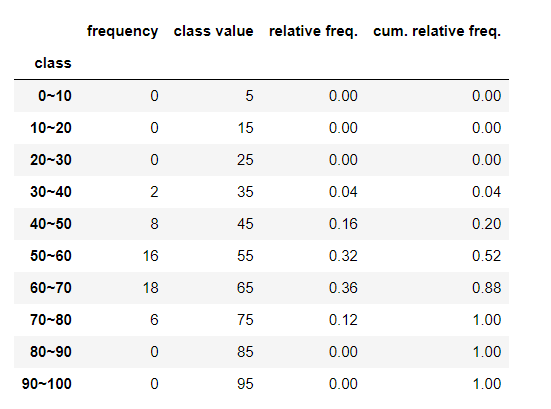

# 데이터 시각화

- 데이터 분석 목적에 따라 시각화 도구가 달라진다

## 도수분포표

- 계급 : 구간

- 도수 : 각 계급에 속한 빈도수

  

### histogram()

- 도수분포표를 작성할 때 도수를 쉽게 구할 수 있는 함수:

- np.histogram(data, bins=, range=):
  - range의 범위안(최소값,최대값)에서 bins만큼의 계급 개수로 이루어진 histogram을 만든다.
  - bins가 숫자 하나라면, 그만큼의 개수의 계급을 만들고, list라면 그 list를 활용해서 계급을 만든다
  - 두 인수를 반환하는데 첫번째는 빈도수(freq)고, 두번째는bins 반환(계급)
    

```python
freq, _ = np.histogram(eng, bins=10, range=(0,100))

# bins 문자열 작성
freq_class = [f'{i}~{i+10}' for i in range(0,100,10)]

# freq_class 인덱스로 df 생성 (도수분포표):
freq_dist_df = pd.DataFrame({'frequency': freq}, index=pd.Index(freq_class, name='class')) # 인덱스의 이름까지 지정, pd.Index라는 함수 사용

# 계급값 생성
class_value = [(i + (i + 10))//2 for i in range(0,100,10)]

# 상대도수 : 전체 데이터의 빈도수 중에 해당 계급이 차지하는 비율
rel_freq = freq/freq.sum()

# 누적상대도수 : 상대도수를 누적합한 것. 그래서 크기는 점점 커지고 마지막은 1이다
cum_rel_freq = cumsum(rel_freq)

# freq_dist_df라는 도수분포표 확장:
freq_dist_df['class value'] = class_value
freq_dist_df['relative freq.']=rel_freq
freq_dist_df['cum. relative freq.']=cum_rel_freq

```



```python
# 도수분포표의 최빈값(가장 빈도수가 높은 값):
>>> freq_dist_df['frequency'].idxmax() #frequency열 중에서 가장큰 값의 인덱스를 반환해라
'60~70' 

# frequency의 최빈값이 있는 계급의 class value의 값은?
>>> freq_dist_df.loc[freq_dist_df['frequency'].idxmax(),'class value']
65
```


##### 히스토그램 생성:

- 도수분포표를 막대그래프로 나타낸 것

- numpy의 histogram() 함수와는 다르지만 인수는 같다
- Matplotlib의 hist()함수 사용
- bins가 클수록 범위가 좁기 때문에 그래프가 더 정교하고, bins가 작을수록 그래프가 더 뭉툭하다
- plt.hist(eng, bins=, range=)


## Boxplot()

- np.boxplot()


## 백분위수 및 사분위수 계산

- np.percentile(data,0~100) : 100분위수라서 0~100사이 값 넣어준다.
  - 예) np.percentile(x,10) : 하위 10%
- np.quantile(data,0~1) : 0~1사이 값으로 써준다