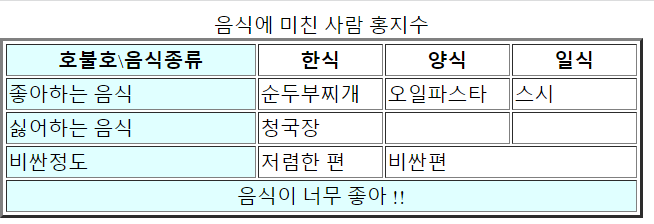

# WEB

- 클라이언트=Browser,우리, 요청 받는 입장

- 서버=게임회사, 요청을 받고 응답 해주는 입장

- 클라이언트는 서버로 요청하고 서버는 요청에 맞는 데이터로 응답해주는 관계

- 번외로 유용한 사이트들 :
- mdn : https://developer.mozilla.org/en-US/  => 자바위주
- w3schools : https://www.w3schools.com/ => 여러언어 학습 가능

- Representational State Transfer(REST) : 

  - 자원의 이름으로 구분해서 해당 자원의 정보를 주고 받는 모든 것
  - 네트워크에서 client와 server사이의 통신 방식 중 하나이다
  - 어떠한 자원( 문서, 그림 등을 포함한 데이터)에 대해 요청 처리를 하기 위해 GET, POST 등의 메서드를 활용해서 서버에 요청을 보내고 요청을 위한 자원은 특정한 형태로 표현된다

- RESTful:

  - REST의 설계규칙을 잘 지켜서 설계된 API
  - RESTful하다는 것은 요청을 보낸 주소만으로도 어떤 것을 요청하는지 파악이 가능하다는 뜻

  

## Integrated Development Environment (IDE)

- 파이참, VScode처럼 하나의 GUI가 여러 개발자툴을 모아놓고 한번에 사용할 수 있게끔 한 소프트웨어
- 컴파일러 : 전체의 소스코드를 한번에 수집해서 재구성한다
- 인터프리터 : 소스 각 행을 하나씩 보고 실행한다.


## HTML

> HyperText Markup Language로 온라인 상의 데이터(문서, document)를 구조화(markup) 시키는 언어

- 데이터를 정리하는 언어 
- HTML이 정보를 구조화하고 CSS는 정보를 꾸민다라고 생각하면 된다.


라이브 서버로 열었을 때 :

- http://127.0.0.1:5500/web01-html/index.html 

  - http:// : 이 통신규약으로 서버와 통신하고 있음
  - 127.0.0.1 => 이거는 '나, local host'. 이 ip를 사용해서 접속 
  - : 
  - 5500 => port. 5500포트번호로 접속을 했다
    - 다른 곳에서는 5500포트로 할 수가 없다 
  - ------ 여기까지는 루트 (기본)-----
  - /web01-html/index.html -> 이 파일을 열었다

  

- HTML의 구성 : 
  - !doctype html은 이 문서가 html로 만들어졌다는걸 표시하기 위해 작성한다
  - html은 head와 body를 감싸고 있다

```html
<!doctype html>
<html>

<head>

</head>

<body>

</body>

</html>
```

- `<>`  이거는 시작 태그 `</>`  이거는 끝태그
- 태그 사이에 데이터가 들어가고, 시작 태그 내에서 속성을 정의한다
- 시작태그와 끝태그가 따로 없고 합쳐진 태그들도 몇몇 존재 : img, input, br, hr, meta등
- `<head>` : 문서 정의. 
- `<body>`:  메인 내용 작성
- 시작태그 내에 들어가는 속성들 :
  - `<h1 style="color: green">`
        


#### 블록요소 & 인라인요소

- 블록요소 : 자기 태그가 있는 화면 처음부터 화면 끝까지 자신의 영역으로 가지고 있음. 새로운 태그를 쓰면 __자동으로 줄을 바꾼다__ 왜냐하면 끝까지 내 영역이니까. 각 태그마다 블록요소와 인라인 요소가 나뉘어져있음. 
  - 블록요소 내에 블록요소 or 인라인 요소 가능
  - div, p, article, dd, dl, ol, p, pre, table, ul가 대표적이다
  - list형태는 다 블락요소이다
- 인라인요소 : 자기 태그가 가지고 있는 문서 내용만 자신의 영역으로 가지고 있음. 한줄에 내용이 다들어감
  - 인라인요소 안에 블록요소 포함 불가능하다. (가끔 크롬 같은 브라우저는 블록요소 안에 썼을 때 만들어주기도 하지만 실제로 코딩할 때 인라인요소안에 블락요소 넣는 것은 피하자)
  - span, select, sub, sup, var 
  - 뭔가 글작성말고 특별한 기능(sub,sup 등)이 있는 것들은 인라인요소가 대부분


#### HTML 태그

- `html:5` : 이전거 보여줌


- `<h1>`, `<h2>` .. :  head1, head2로써 제목 지정하는 태그, h1은 왠만하면 한번만 작성

- `<br/>` : 줄띄어쓰기(enter) ; break
  
  - br는 여는태그랑 닫는 태그가 합쳐져있다. 5버전에서는 `<br>` 이렇게만 작성해도 된다
  
- `<!--내용-->` : 주석 작성

- `<a>` : 링크를 만들어주는 태그 ;anchor
  
  - `<a href="링크">제목</a>` : 해당제목을 누르면 하이퍼링크
  
  - `target="_blank"` : 링크 클릭시 새창에서 페이지가 열림
  
  - `title=""` 툴팁(tooltip)으로 어떤 내용담고있는지 보여줌 ; 커서를 갖다대면 조그맣게 뜨는 창
  
  - :heavy_check_mark: 만약 www. 이후로만 작성하면 오류가 뜨는데, 그 이유는 컴퓨터가 http를 작성하지 않으면 로컬에서 찾기 때문이다. 그래서 꼭 http://를 작성해주어야한다
  
  - a태그는 __같은 페이지 내의 특정 위치로 이동__도 가능하다
  
  - ````html
    <a href="#a">특정위치로 이동<a/>
    <br>
    <br>
    <br>
    <br>
    <div id="a"> 여기는 a이다
    </div>
    ````
  
  - ''특정위치로 이동''을 누르면 해당 id a가 있는곳으로 이동한다
  
- `<hr/>` : 직선만들기 ; horizontal rule

- `<h2 style="background-color: blue;">block<h2/>`: block이라는 글자 bkground로 작성

- `<p style="color: red">Hello, World!</p>` : 글씨체 색깔 지정

- `<q>` : "블록요소"중 하나로 짧은 인용문을 가져올 때. "" 자동 작성 ; short quotation

- `<blockquote>` :  다른 출저로부터 인용된 인용블록에 사용. 

- `<span>` :  인라인 요소 중 하나

  


:heavy_check_mark: 꺽새를 표현하고 싶을 때 : `(&lt;텍스트b&gt;)` ==> `<small>작은텍스트(%&lt;small&gt;)` 처럼 \&lt; 붙여주면된다

- `<small>` : 작은 텍스트
- `<sup> ` : 위 첨자
  - 제곱과 같이
- `<sub>` : 아래첨자
  - 함수 이름쓸때 처럼
- `<ins>` : 밑줄긋기 ;insert
- `<del>` : 글중간에 가로선 긋기 ; delete


#### 영역 & 단락 

- `<div>` : 영역 정의. 공간 위를 차지하지 않는다. div는 p를 포함할 수 있다. HTML 여러 요소들 하나로 묶어줌. 용도는 __HTML 영역별 구분__. 일종의 컨테이너로 자주 사용된다. 나중에 CSS로 스타일 변경할 때 편리해진다
  - 후에 나오는 article, nav 등의 태그도 div의 연장선이다

- `<p>` : 단락정의 ; paragraph, for text라서 __p아래에는 다른 블록 요소가 포함되어서는 안된다. only 인라인 요소만 가능__

```html
<div>
    <p> 단락 정의 </p>
    <p>
        para1
        para2
    </p>
<div/>
```


#### 웹 접근성 태그

> 시각 장애인 등 글을 읽는데 불편함을 느끼는 분들을 위해 조금 더 강하게 글을 읽어준다

- `<b>` : bold체

- `<strong>` : 위b랑 겉보기로 우리한테 같지만, 잘안보이시는 사람들(시각 장애인)한테 좋은 웹 접근성 태그
- `<i>` : 기울임 ; italic
- `<em> ` : 기울임, 강조. 웹 접근성 태그 ;emphasis


#### 이미지 삽입

- ``
  - ``


##### 이미지에 링크 걸기

```html
<a href='링크'> #해당 링크로 연결해줘라
	 # 해당 이미지를 눌렀을 때. 들여쓰기 중요!
</a> # 여기서 닫는다
```


##### 이미지의 __특정 부분__ 링크 걸기

- usemap은 map 태그와 함께 사용하는데 image와 map과의 연결을 도와준다

```html
 #usemap이름을 my로 지정한 그림 생성
    <map name="my"> 
        <area shape="rect" coords="25, 25, 175, 175" href="index.html" alt="그림일껄?"> #my라는 부모 이미지 기준으로, (25, 25, 175, 175) 위치의 내부 사각형을 그림 내에 만들어서 href로 가라. 
    </map>
```


#### List & Order

- 순서가 있는 리스트 생성 :

  - ol ; ordered list
  - li ; list itmes
  - ol 안에 li를 작성한다
  - ol안에 li작성하고 또 li안에 ol작성가능(새로운 번호로)
  
  
  
- 비순차적 목록 생성(동그라미 생성):

  - ul ; unordered list
  - li
  - 마찬가지로 ul안에 li, li안에 ul 가능

  

- 비순차적 목록 생성(동그라미x, 들여쓰기만)

  - dl ; definition/description list
  - dt ; title
  - dd ; data
  - dl안에 dt 한개 dd로 작성

  ```html
  <dl>
  	<dt>제목<dt/>
  	<dd>내용1<dd/>
  	<dd>내용2<dd/>
  </dl>
  ```

  - dd안에 dl을 생성해서 또 dt dd작성 가능하다
  
  

#### Table

- 테이블은 정리하기 편하다는 점에 다른 용도로도 쓸 수 있지만 실무에서는 정말 테이블을 만들고 싶을 때만 사용한다

- `<tabel>` 먼저 작성

  - border='n' : 데이터 디자인type
  - caption : 테이블 제목

- 테이블 작성의 큰 틀 :
  - colgroup: column에 대한(세로열) 설정 가능. 내용 작성이 아니라 컬럼에 대한 큰 틀을 정의한다 생각하면 된다.
    - `<col width= style="background-color" ...>` --> 첫번째 세로열 설정
    - `<col width= style="background-color" ...>` 두번째 세로열 설정
  - thead
  - tfoot
  - tbody

- tr: 테이블 로우다

- th; 테이블 헤더로 열이름을 뜻한다

- td: 테이블 데이터로 데이터 작성

- 셀병합
  - rowspan="n" : 로우들끼리 합치니, 세로로 늘어난다. td안에 작성한다
  - colspan="n" : 컬럼끼리 합치니 가로로 늘어난다. td안에 작성한다

- ```html
  <body>
      <table border="3">
          <caption>음식에 미친 사람 홍지수</caption>
          <colgroup>
              <col width="200px" style="background-color: lightcyan;">
              <col width="100px" >
              <col width="100px" >
              <col width="100px" >
          </colgroup>
  
          <thead>
          <tr>
              <th>호불호\음식종류</th>
              <th>한식</th>
              <th>양식</th>
              <th>일식</th>
          </tr>
          </thead>
  
          <tbody>
          <tr>
              <td>좋아하는 음식</td>
              <td>순두부찌개</td>
              <td>오일파스타</td>
              <td>스시</td>
          </tr>
          <tr>
              <td>싫어하는 음식</td>
              <td>청국장</td>
              <td></td>
              <td></td>
          </tr>
          <tr>
              <td>비싼정도</td>
              <td>저렴한 편</td>
              <td colspan="2">비싼편</td>
          </tr>
      </tbody>
  
      <tfoot>
          <td colspan=4 align='center'>음식이 너무 좋아 !!</td>
      </tfoot>
      </table>
  </body>
  </html>
  ```





#### Layout

##### 1) div로 나누기

- head에 작성: css코드로 레이아웃의 디자인 변경

- `<style type="text/css"> `:text파일인데 css로 불러왔다. 필수작성은 아니다.

- 기본 형식: (밑에는 css이다)

```html
<style type="text/css">
        *{
            padding: 0px;
            margin: 0px;
        }
        
        div{
            border: 1px dashed blue;
            margin: 10px;
        }

        #body{
            height: 400px;
        }

        #left{
            width: 48%; /* 퍼센트로 기록한 이유는, 지금 div의 width를 정확히 모르는 상태에서 margin이 들어가서 계산이 힘드니 % 설정*/
            height: 90%;
            float: left;
        }

        #right{
            width: 48%; /*퍼센트에 따라 왼쪽 프레임과 오른쪽 프레임의 간격을 지정 가능*/
            height: 90%;
            float: right;
        }
    </style>
```

- 위에 #{}으로 작성된 코드는 해당 id를 가지고 있는 태그를 꾸며주는 코드다.
- content바깥에 padding이 있고, 그 밖에 border, 그 밖에 또 margin이 있다.

body에 작성:

```html
	<div id="header">
        <div>
            <span><a href="#">1</a></span>
            <span><a href="#">2</a></span>
            <span><a href="#">3</a></span>
            <span><a href="#">4</a></span>
        </div>
    </div>

    <div id="body">
        <div id="right">
            <p>레이아웃은 어렵다<br>
                어렵지만 재밌는거 같기도하다<br>
                그래도 파이썬 같은거 훨배 재밌다<br>
                직관적이긴하다</p>
        </div>
        <div id="left">
            <p>사실 그냥 자고싶다</p>
        </div>
    </div>

	<div id="footer">
        <address>copyright &copy; all rights reserved ...</address> <!--address는 주소 작성 글씨체로 변환-->
    </footer>
   	</div>
</body>
</html>
```

- span은 inline이라는 특성때문에 작성을 해놓았고, 나중에 메뉴를 만들어서 해당 글자를 클릭하면 다른 사이트로 넘어갈 수 있도록 a를 작성했지만 현재는 마땅한 링크가 없어서 #을 써논 것임.
- div로 섹션들을 일일이 나누고 (블락라인요소니 아래로 차례로 블락 생성하는 특성때문에)id로 가독성있게 레이아웃 생성
- head에 작성된 코드 중 div{}는 실제 body에서 div로 생성된 모든 코드들에 적용이 되는 것이다


##### 2) 시멘틱태그(Semantic Tag) : class 활용

- 시멘틱 태그  : form, table, article처럼 태그명의 뜻이 직관적으로 이해할 수 있는 이름.  HTML의 소스 코드만 보고도 쉽게 파악 가능하고 또 시각장애인이 특성 파악하는 데도 쉽다는 장점

  - 상단부 : header, nav ;헤더 안에 nav가 있다

  - 중앙부 : section이 있고 section안에 articles가 있다. 사이드에 aside가 있다

  - 하단부 : footer 

```html
   <header class="misspython">
        <h1>제목</h1>
        <nav class="misspython"> 
            <span><a href='#'>1</a></span>
            <span><a href='#'>2</a></span>
            <span><a href='#'>3</a></span>
            <span><a href='#'>4</a></span>
        </nav>
    </header>

    
    <!--아까의 body-->
    <section class="misspython">
        <article class="misspython" id="left">
            <p><p>레이아웃은 어렵다<br>
                어렵지만 재밌는거 같기도하다<br>
                그래도 파이썬 같은거 훨배 재밌다<br>
                직관적이긴하다</p>
        </article>

        <article class="misspython" id="right">
            <p>사실 그냥 자고싶다</p>
        </article>
    </section> 

    <footer class="misspython"> 
        <address>copyright &copy; all rights reserved ...</address>
    </footer>

</body>
</html>
```

- 비슷한 내용이지만 여기서는 class=misspython으로 위에 div를 대체했다.
- div랑 시멘틱이랑은 차이가 없다. 다만 시멘틱 태그가 더 직관적이고 최근에 나온 기능이라는 것이다. 


### Form

##### 1. get 

- `<form>` : 폼의 범위를 표시한다. input과 같은 컨트롤로 구성되는 영역이다. 폼을 열고 닫을때까지 작성한 내용들이 폼의 영역이다.
  - `form( action= method=)` : 
  - action:  주소
  - method: 클라이언트와 서버간의 데이터 주고받는 방식 ; get or post로 방식
- get은 request의 헤더에 값을 저장해서 보낸다 --> querystring을 보낸다
- `fieldset` : 폼 필드 세트. 폼 내에서 관련 컨트롤을 하나의 그룹으로 묶은것으로 폼을 계층화 시키기 편리하다. 
  - fieldset을 사용하면 큰 form 박스처럼 테두리 생성
- `legend` : fieldset과 함께 사용하는 것으로 fieldset요소의 제목을 표시


- `input( type="" name="" value="")`
  - type으로 데이터를 받는 방법을 선택
  - name은 폼 submit을 할 때 서버(전달받는 페이지 입장)에서 name명으로 값을 가져올 수가 있다 ; 인풋태그의 호수
  - value는 해당 태그 값/전달할 값. 만약 value값을 지정안했다면, 사용자가 작성한 답이 value가 된다 ; 내용물
  - 그래서 text같이 내용물이 중요한 타입은 value를 따로 지정하지 않고, radio처럼 객관식은 value를 따로 지정하는 경우가 대부분인게 내 뇌피셜
- type:
  - radio : 여러개 중 하나만 선택
  - checkbox : 다중선택 가능. 체크되어있는 데이터만 전송
  - text : 일반텍스트박스
  - password : 암호처리가 된 박스
  - textarea : 가로너비가 길고, 사이즈를 자유롭게 수정할 수 있는 텍스트 박스
  - button: 그냥 버튼
  - reset: 취소버튼
  - submit: 버튼을 누르면 클라이언트가 서버한테 action에 있는 것을 요청하게 되고 그것에 대한 응답을 받게 된다

:heavy_check_mark: href도 하이퍼링크라 생각하지 말고 서버가 응답해준 결과라고 생각하면 좋다.

- get 방식으로 불러오면 link는 :
  -  http://127.0.0.1:5500/web01-html/html-form-res.html?id=jisuhongeism&pw=dffasf&rdo=n&web=web&etc=dddd
  - ?이후에 있는 글자(값)들을 query string이라고 한다
  - 뒤에보면 아이디부터 패스워드까지 내가 제출했던 값들이 다 기록된다
  - name & value를 링크로 전달한다.


##### 2. post

- get과 다르게 body에 붙어서 데이터가 전송된다
- post는 주소가:

- http://127.0.0.1:5500/web01-html/html-form-res.html 
  - post는 주소 뒷부분에 쿼리스트링이 나오지않는다. value를 숨겨준다.

- 보안 측면에서 훨씬 유용하다


### Select

- 폼에서 쓰이는 컨트롤과 비슷하다
- 마찬가지로 `form` 태그 내에서 활용한다

- 

- input과 같은 컨트롤과는 다르게, _select와 option_태그를 활용한다 ; 대신 select 작성 후에 `<input type="submit">` 는 작성해서 서버에 요청할 수 있도록 해야한다.
- `<select name=>` : name은 for 서버, select하나당 하나의 select 컨트롤이 만들어진다
  - `<optgroup label=>` 하나의 셀렉트에서 있는 소그룹, label은 사용자가 보는 이름. optgroup없이 작성도 괜찮다
    - `<option value= >이름</option>` : value는 서버로 전달되는 이름이고 '이름'은 사용자한테 보이는 이름

```html
<form action="" method="post">
    
	<p>
	좋아하는 운동
		<select name="exercise">
			<optgroup label="기구운동 종류">
				<option value="running">런닝</option>
				<option value="cycling">사이클링</option>
				<option value="boxing">복싱</option>
			</optgroup>
			
			<optgroup label="맨몸운동 종류">
				<option value="running">스쿼트</option>
				<option value="pushup">푸쉬업</option>
			</optgroup>			
		<select/>
            
        <select>
            

        </select>
   </p>
        
        <input type="submit" value="선택">
        
</form>
```


### 기타 팁 :

- 그냥 열었을 때 :

  - file:///C:/workspaces/web/web01-html/index.html 로컬 저장 타입. 절대경로로 열림
  
  
    - "html01-start.html" : 이거는 상대경로
  
  
  
    - ./ 나와 같은 위치, 폴더에 들어가 있는애를 지칭한다. 상대경로는 ./ 이게 생략되어있다
  
  
  
    - ../ 이거는 위 폴더로
  


- 쌍 따옴표, 싱글 관계없다.
- 원래는 라이브서버말고 Django이지만 지금은 라이브서버라는 VScode내 패키지 사용
- F12로 웹의 개발자도구를 열 수 있다

- 속성 뒤에는 세미콜론 안써도되지만 속성이 여러개면 세미콜론을 써줘야한다
- index파일에 ctrl누른상태에서 누르면 파일 만들어준다


