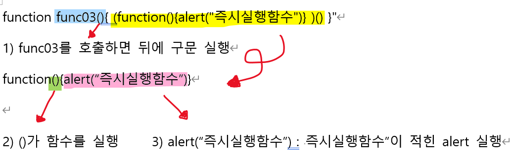

# JavaScript

## 함수

- `<scirpt>`내에 함수를 정의한다.
- `<p onclick="함수명()">사용자한테 보일 내용</p>`

### 명시적 함수: 

- 우리가 생각하는 일반적인 함수가 정의/선언된다

### 익명 함수: 

- script태그 안 : `var func02 = function(){alert("익명함수")}`

- var x = 값. (여기 값에 function(){}). 함수가 값으로 이용되었음.

- 실행문 안 : `<p onclick="변수명()">`

- 함수의 탈을 쓴 변수가 아니라, 함수는 함수인데 값으로 만들어진 함수인 것이다. 

- func02()를 작성하면?

  - function(){}가 호출된다. 즉 함수가 호출된다

- func02만 작성하면?

  - func02의 __값만 불러온다__

  

### 즉시실행 함수:

- 안에 비밀함수가 바로 시행된다

- script태그 안: `function func03(){ __(function(){alert("즉시실행함수")})__()}"`

  - 여기서 bold체가 비밀함수임.

- 실행문(body) 안: `<p onclick="func03()">즉시 실행 함수</p>`

- 

  함수호출 : body에서 func03을 호출한다 => func03은 1) 뒤에 ()안 구문 실행한다 => 2) 뒤에 ()로 인해서 이름이없는(비밀함수)function을 호출한다 => 3) alert를 실행한다.


### 함수 리터럴 :

- 스크립트 태그안:

```javascript
function literalPrn(literal){
    literal("안녕하세요 함수 형태의 값이다");
}

function func04(){
    literalPrn(function(msg){alert(msg)});
}

```

- 실행문(body)안 : `<p onclick="func04()">함수리터럴</p>`


- func04 함수를 호출 ->  'function(msg){alert(msg)}'라는 함수 정의문(비밀함수)를 인자(argument)로 한 literalPrn함수를 호출 -> literalPrn이 정의된 젤 윗 쪽에서 literal의 인자로 'function(msg){alert(msg)}' 을 받고, literalPrn실행 -> literalPrn구문은 실행하면 function(msg){alert(msg)}(literal과 동일)의 인자로 "안녕 나는 함수 형태의 값이야"가 들어간다.

- 즉 literal이라는 매개변수를 호출하는데 그 literal이 함수네? 함수를 호출하는데 msg라는 매개변수가 필요하네? ()안에 안녕 나는 함수형태의 값이야가 적혀있네?


### 클로져

- 내부함수에서 외부함수에 있는 것들을 접근할 수 있음
- 스크립트 태그안:

````javascript
function closureFunc(val){
	var suffix = "님, 안녕하세요 ";
	function innerFunc(){
	alert(val + suffix + "잘 부탁드려요")
}
	return innerFunc;
}

var closureTest01 = closureFunc("멀캠");
````

- body안 :  `<p onclick="closureTest01()">클로저 : 외부함수에 접근 가능 (변수 등)</p>`

-> clousreTest01()을 호출한다 -> closureTest01은 변수이고 closureFunc("멀캠")을 호출(실행)했다 -> 멀캠을 val의 argument로 받는다. -> suffix라는 변수가 정의되고 innerFunc()함수가 정의된다. -> __정의만 되고 호출/실행이 안된 상태 "{alert(val + suffix(님, 안녕하세요)+ "잘 부탁드려요")}" 이 구문 그대로오오오 return구문 때문에 closureTest01을 호출한 값으로 반환__된다. -> 이전에 보았다 싶이 closureTest01이라는 변수는 body에서 __closureTest01()__로 호출되었다

- 이 부분 이해가지 않으면 반대 순서로 생각해보면 쉽게 이해가된다.

:heavy_check_mark:헷갈리지 말아야할 것은 함수가 정의된 곳에서는 ()가 추가로 없으면 정의만 하고 끝난다. 하지만 이미 함수가 정의되어있고 함수를 호출하는 상황이라면 추가로 ()를 작성할 필요가 없다

```javascript
function func01(){
alert("함수호출 안됨")
}

function func02(){
alert("함수호출 됨")
}()

func03("함수호출 됨")
```

